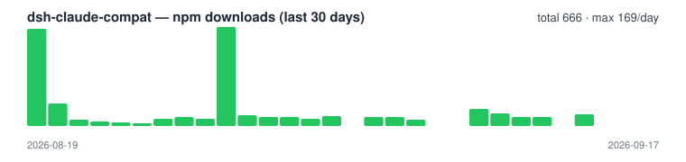

<p align="center">
  
</p>

<h1 align="center">dsh-claude-compat</h1>

<p align="center">
  <a href="README.zh-CN.md"></a>
  
  
  
  
</p>

> **Reuse your entire Claude Code setup in DSH — zero migration.**
> skills, commands, rules, agents, hooks, MCP — install and they just work. Nothing to reconfigure.

---

## The 10-second pitch

You've already built up a solid `.claude/` in Claude Code — skills, slash commands, rules, agents, hooks, MCP servers. Moving to **DSH (DeepSeek Harness)** shouldn't mean rebuilding all of it.

**dsh-claude-compat is that bridge.** It carries your `.claude/` directories **verbatim into DSH** — everything works immediately. Install once, and both sides share one config: change it in one place, it updates in both.

```bash
dsh plugin --profile web add dsh-claude-compat@latest
dsh web
```

Done. Your skills show up in the `/` menu, rules inject into every new session, and you can invoke agents with `/agent-name` — all inside DSH, exactly like Claude Code.

**Or let DSH install it itself (recommended):** copy this line to DSH — it reads the skill, installs, and verifies:

> Read https://github.com/biedongbin/dsh-claude-compat/blob/main/.claude/skills/install-dsh-compat/SKILL.md and install the dsh-claude-compat plugin following its steps.

> ⭐ Find this useful? [Give it a star](https://github.com/biedongbin/dsh-claude-compat) — it keeps us improving and helps more people discover it.

---

## What it brings over — at a glance

| Your Claude Code asset | Becomes in DSH | How to use it |
|---|---|---|
| `skills/**/SKILL.md` | DSH skill (lazy-loaded) | `/skill-name`, the `skill` tool, and the model-visible catalog |
| `commands/*.md` | DSH skill (user-invocable) | `/command-name` in the slash menu |
| `rules/*.md` | message-stream injection (same channel Claude uses) | auto-applies to every new session |
| `agents/*.md` | delegation-shim skill | invoke `/agent-name` with its persona |
| `.claude/settings.json` hooks | Pre/PostToolUse + UserPromptSubmit bridged | commands, permissions, blocks behave as before |
| `<root>/.mcp.json` | `dsh-mcp-client` instances | stdio / streamable-http auto-translated |
| `~/.claude/plugins` | DSH skill (managed via `/cc-plugin`) | installed plugin skills work too |

Both the project `.claude/` and the user-level `~/.claude/` are read. Same-name entries dedupe by fixed priority: **project `.claude` > DSH native > `~/.claude`** — a project skill always wins over other copies, and a user skill never overrides a DSH-native one. `CLAUDE.md` / `AGENTS.md` are handled by DSH's built-in `dsh-agent-instructions` — **this plugin never touches them**.

## What it does (implementation detail)

| `.claude/` path | Mechanism | Behavior |
|---|---|---|
| `skills/**/SKILL.md` | DSH skill provider | Name + description in the model-visible catalog; body loads on demand via the `skill` tool. New skills appear on the next catalog reconcile — no restart. |
| `commands/*.md` | DSH skill provider | Same, plus user-invocable: `/command-name` works in the slash menu. |
| `rules/*.md` | Message-stream injection | Rules are concatenated, wrapped in a `<system-reminder>` envelope, and prepended as a user-role message at the front of the message array once per session — the same channel Claude Code uses (`prependUserContext`), which models follow reliably. |
| `agents/*.md` | DSH skill provider (delegation shim) | DSH has no markdown subagent format, so each agent file becomes a **skill** whose body leads with an explicit "delegate with this persona" instruction. Model- and user-invocable, so `/agent-name` works. Same-name agents dedupe by rank like skills. |
| `.claude/settings.json` → `hooks` | Tool/prompt hooks | Claude Code hooks subset bridged onto DSH's `tools/pre-execute` (PreToolUse), `tools/post-execute` (PostToolUse) and `agent/pre-step` (UserPromptSubmit) waterfalls. Commands run via `/bin/sh -c` with a Claude-style JSON payload on stdin; exit code 2 denies/blocks, `hookSpecificOutput` overrides are honored, timeouts allow through with a warning. |
| `<projectRoot>/.mcp.json` | MCP servers | Claude Code-format MCP server definitions are translated to `dsh-mcp-client` plugin instances at DSH startup from the launch workspace: `command` → stdio, `url` → streamable-http. Malformed entries or a missing `@deepseek-ai/dsh-mcp-client` degrade to a warning, never a crash. |
| `~/.claude/plugins` (installed plugins) | DSH skill provider | Installed Claude Code plugin-marketplace plugins contribute their skills/commands/agents (via each install's `.claude-plugin/plugin.json` manifest, or a directory scan when manifest-less) at rank `750` — the long tail: project `.claude`, DSH native, and `~/.claude` all win collisions. Plugin MCP servers (`mcpServers` in the manifest) mount only when `enablePluginMcp` is opted in — mounting third-party MCP servers is a bigger trust step than listing skills. |

The same directories are also read from the **user-level** `~/.claude/` (skills, commands, rules, agents, and `~/.claude/settings.json` hooks). Same-name skills/commands/rules/agents are deduped with a fixed priority:

**project `.claude` > DSH native (`.dsh`) > `~/.claude`**

- Project `.claude` entries carry rank `50`; DSH's own skills — project `.dsh` roots, `.agents` roots, and bundled skills (ranks `100`–`600`, `BUNDLED_SKILL_RANK`) — sit in between; `~/.claude` entries rank `700`. So a project skill always overrides the DSH-native and user copies, and a user skill never overrides a DSH-native one.
- Rule files with the same basename in `~/.claude/rules` are skipped when the project already provides one.

`CLAUDE.md` / `AGENTS.md` are **not** touched — DSH's built-in `dsh-agent-instructions` already handles those.

## Built-in commands

Installing this plugin adds three management skills to the catalog:

| Command | What it does |
|---|---|
| `/cc-plugin` | Full Claude Code plugin management: `list`, `install <name>[@marketplace]`, `uninstall`, `enable`, `disable`, `update [name]`, `search <term>`, `marketplace list\|add\|remove\|update`. One-shot syntax `/cc-plugin <name>@<marketplace>` installs directly. Engine: the `claude` CLI when available, otherwise a built-in fallback (direct JSON + git, with timestamped backups of every file it touches). All state stays in Claude-native locations (`~/.claude/plugins`, `~/.claude/settings.json` `enabledPlugins`) so Claude Code and DSH read the same truth. |
| `/reload-cc-plugins` | Hot-reload the skill catalog: drop cached provider lists and notify observers so newly installed/removed skills appear in the **current session** — no restart, no new session. |
| `/reload-skills` | Alias of `/reload-cc-plugins`. |
| `/cc-export` | Export DSH-native skills (`.dsh/skills`) into Claude Code `.claude/skills/<name>/SKILL.md` with frontmatter preserved. `list` / `export [--overwrite] [--target]`. |
| `/cc-resume` | List Claude Code conversation sessions for the current project (`~/.claude/projects/`) and import any of them into DSH with full user/assistant/tool history. Imported sessions appear in the DSH session list titled `cc: <preview>` and resume like native ones. `list` / `import <sessionId>` / `--limit-turns N` for huge sessions. |

Typical loop: `/cc-plugin install ralph-loop@claude-plugins-official` → `/reload-cc-plugins` → new skills visible immediately. Plugin-shipped MCP servers still require a DSH restart (process-lifetime mount).

## Requirements

- DSH with a profile (e.g. `web`)
- A project using Claude Code conventions: `.claude/skills/`, `.claude/commands/`, `.claude/rules/`, `.claude/agents/`, `.claude/settings.json`, and a project-root `.mcp.json` (all optional; `~/.claude/` equivalents are also picked up)
- `pnpm` on `PATH` — `dsh plugin` is a thin pnpm forwarder

## Install / Update

One command — the package declares `dsh.bundle`, so DSH activates it automatically (no manual `cordis.patch.yml` editing). Install or update to the latest release:

```bash
dsh plugin --profile web add dsh-claude-compat@latest
```

Or from GitHub:

```bash
dsh plugin --profile web add github:biedongbin/dsh-claude-compat
```

Restart DSH (`dsh web`). Done — skills show up in `/`, rules are injected into every new session.

## Configuration

| Option | Default | Description |
|---|---|---|
| `enableSkills` | `true` | Register the `.claude/skills` + `.claude/commands` + `.claude/agents` provider (project and `~/.claude`) |
| `enableRules` | `true` | Inject project + `~/.claude` `rules/*.md` into the message stream |
| `enableMcp` | `true` | Translate `<projectRoot>/.mcp.json` into mounted MCP server plugins |
| `mcpFailOnStartupError` | `false` | Forward to `dsh-mcp-client`: fail plugin startup when an MCP server fails to connect |
| `enableHooks` | `true` | Run `.claude/settings.json` hooks (Pre/PostToolUse, UserPromptSubmit) |
| `hooksTimeoutMs` | `60000` | Per-hook run timeout (UserPromptSubmit capped at 10s regardless) |
| `enableAgents` | `true` | Surface `.claude/agents/*.md` as delegation-shim skills |
| `rulesMaxBytes` | `65536` | Hard cap on total injected project rules text |
| `userRulesMaxBytes` | `65536` | Hard cap on total injected `~/.claude/rules` text |
| `projectRootMarkers` | `[".git"]` | Ancestor markers for project-root discovery |
| `skillRank` | `50` | Provider rank for project `.claude` skills (wins every DSH-native collision) |
| `skillSource` | `project-claude` | Source tag for project catalog entries |
| `userSkillRank` | `700` | Provider rank for `~/.claude` skills (loses to DSH-native `600`) |
| `userSkillSource` | `user-claude` | Source tag for `~/.claude` catalog entries |
| `userClaudeDir` | `~/.claude` | User-level `.claude` directory (`~` expands to the home dir) |
| `enablePlugins` | `true` | Surface skills/commands/agents from installed Claude Code plugins (`~/.claude/plugins`) |
| `pluginSkillRank` | `750` | Provider rank for plugin content (the long tail — everything else wins) |
| `pluginSkillSource` | `claude-plugin` | Source tag for plugin catalog entries |
| `pluginsRoot` | `~/.claude/plugins` | Plugin-marketplace root (`installed_plugins.json` + `cache/`) |
| `enablePluginMcp` | `false` | Mount plugin-declared MCP servers (opt-in; requires `enablePlugins` and `enableMcp`) |
| `enablePluginManager` | `true` | Register the `/cc-plugin`, `/reload-cc-plugins`, `/reload-skills` management skills |
| `pluginManagerRank` | `40` | Rank for the built-in management skills (top of the catalog) |

## Notes

- **Skill naming**: DSH requires kebab-case skill names. Nested skill directories are flattened (`gitnexus/gitnexus-guide` → `gitnexus-gitnexus-guide`); invalid frontmatter names fall back to the directory name.
- **MCP lifecycle**: `.mcp.json` is read once at DSH startup from the launch workspace — not per session — and each server mounts for the process lifetime. Restart DSH to pick up edits.
- **Hooks scope**: a deliberately small subset of Claude Code hooks: PreToolUse / PostToolUse / UserPromptSubmit. Matchers support exact names, `*` wildcards, and `|` alternation; commands run with `stdin` carrying the Claude-style JSON payload. Exit code 2 = deny (Pre) / block (Post); other non-zero exits and timeouts allow through with a warning.
- **Rules granularity**: rules are read per new session (cached per session cwd). Editing a rule mid-session takes effect in the next session.
- **Rules content**: rules are injected verbatim as instructions to the model. Only commit rules you want the model to follow — same trust level as `CLAUDE.md`.
- **Catalog snapshot timing**: the skill catalog is snapshotted when a session is created. Skills installed or edited mid-session surface after `/reload-cc-plugins` (hot reload) or in the next session.

## Troubleshooting

### Known limitation: `/cc-resume` via the skill tool

In some DSH runtime configurations the `skill` tool resolves in an agent-scoped
layer where globally registered providers are not visible — the invocation
returns `skill "cc-resume" is unknown or no longer available` even though the
catalog lists it. This is a DSH runtime layering behavior, not a plugin bug.
The skill body only instructs the model to run the CLI, which is always
available:

```bash
node node_modules/dsh-claude-compat/scripts/cc-resume.mjs list
node node_modules/dsh-claude-compat/scripts/cc-resume.mjs import <sessionId>
```

**DSH won't start back up after a restart / port 3080 stuck.** Old process still holding the port (symptom: `EADDRINUSE` in logs). Use the bundled restart script — it waits for a clean stop, falls back to SIGKILL, and verifies the port before reporting success:

```bash
npx dsh-claude-compat-restart        # bin alias (installed with the package)
bash node_modules/dsh-claude-compat/scripts/dsh-restart.sh   # direct
bash scripts/dsh-restart.sh --no-patch   # skip the prompt patch, restart only
```

The script also re-applies the idempotent `dsh-terminal-bash` prompt patch, which npx/npm updates silently revert. `DSH_RESTART_PORT` overrides the port (default 3080).

**Installed a plugin via `/cc-plugin` but its skills don't show.** Run `/reload-cc-plugins`. Still missing → restart DSH (plugin-shipped MCP servers always need a restart).

**`/cc-resume` import fails on compression.** The importer needs the `zstd` binary (macOS: `brew install zstd`; most Linux images ship it).

**`/cc-plugin` reports "claude CLI unavailable".** The fallback engine handles install/enable/disable; for marketplace add/update, install Claude Code (`npm install -g @anthropic-ai/claude-code`) or manage marketplaces from Claude Code directly.

## Release notes

- **[Changelog](CHANGELOG.md) ([简体中文](CHANGELOG.zh-CN.md))** — release history from 0.1.0 to the latest version.

## Acknowledgments

- [Linux.do](https://linux.do) — community
- [Claude Code](https://claude.com/claude-code) — the `.claude/` conventions this plugin bridges
- [DeepSeek Harness](https://www.npmjs.com/package/@deepseek-ai/dsh) — the runtime this plugin extends

## License

[MIT](LICENSE)

## 📈 NPM Downloads



[Data: api.npmjs.org](https://www.npmjs.com/package/dsh-claude-compat) · [npmtrends](https://npmtrends.com/dsh-claude-compat/)

## ⭐ Star History

If this project helps you, please give it a ⭐ — it motivates us to keep improving.

<p align="center">
  
  
  
</p>

<div align="center">
  <a href="https://www.star-history.com/#biedongbin/dsh-claude-compat&Date">
    <picture>
      <source media="(prefers-color-scheme: dark)" srcset="https://api.star-history.com/svg?repos=biedongbin/dsh-claude-compat&type=Date&theme=dark" />
      <source media="(prefers-color-scheme: light)" srcset="https://api.star-history.com/svg?repos=biedongbin/dsh-claude-compat&type=Date" />
      
    </picture>
  </a>
</div>
